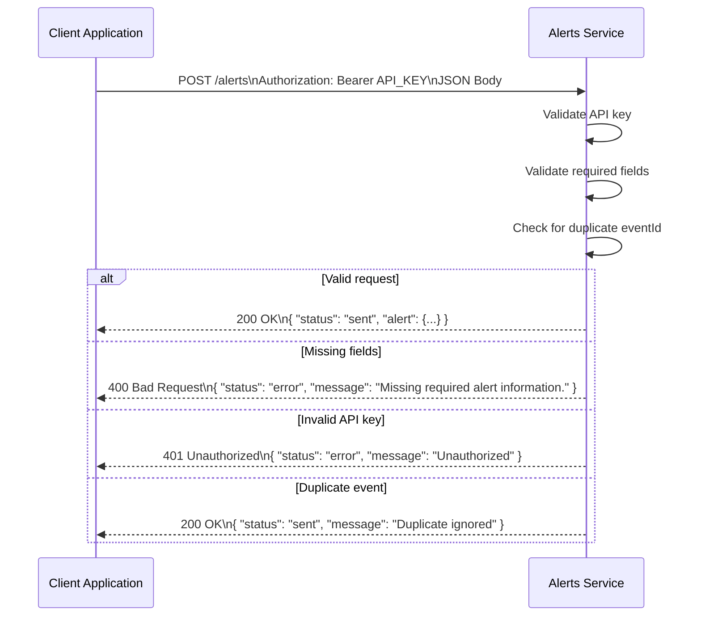

# Alerts-and-Notifications-Service
## Communication Contract – Alerts & Notifications Service (REST API)

### Overview
The Alerts & Notifications Service provides REST API functionality to send deadline reminders, system condition alerts, and general user notifications. The service validates incoming requests, prevents duplicate alerts, and stores alert records. All communication uses JSON over HTTPS, and API key authentication is required for protected operations.

### Base URLs
Local:  
http://localhost:5001

All endpoints are relative to the Base URL.

### Response Format (All Endpoints)
#### Success

```json
{
  "status": "sent",
  "alert": { }
}
```
#### Error

```json
{
  "status": "error",
  "message": "Readable error message"
}
```
### Endpoints
### Send Alert
POST /alerts
Example:  
POST http://localhost:5001/alerts

#### Headers:

Content-Type: application/json
Authorization: Bearer <API_KEY>

#### Body:
```json
{
  "userId": "12345",
  "alertType": "deadline",
  "message": "Your task is due in 30 minutes.",
  "priority": "high",
  "eventId": "task-98765"
}
```
### Success Response:
```json
{
  "status": "sent",
  "alert": {
    "userId": "12345",
    "alertType": "deadline",
    "message": "Your task is due in 30 minutes.",
    "priority": "high",
    "eventId": "task-98765"
  }
}
```
### Error Responses:

### Missing fields:
```json
{
  "status": "error",
  "message": "Missing required alert information."
}
```
Invalid API key:
```json
{
  "status": "error",
  "message": "Unauthorized"
}
```
Duplicate event:
```json
{
  "status": "sent",
  "message": "Duplicate ignored"
}
```



### Authentication Rules
All POST requests require a valid API key in the Authorization header.
Invalid or expired API keys return HTTP 401 Unauthorized.
Sensitive user data is never returned in responses.

### Error Codes
Service may return readable error messages such as:

Missing required alert information.
Unauthorized
Duplicate alert ignored
Invalid request format

### Contract Stability
This communication contract — including endpoints, request structure, headers, response format, and error messages — must remain stable during the sprint unless the entire team agrees to changes.
